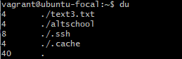

## Linux commands
 
1. **df**
  

Use the **df** command to see the available disk space in each of the partitions in your system.

2. **du**
 

Use the **du** command to know the disk usage of a file in your system.
 