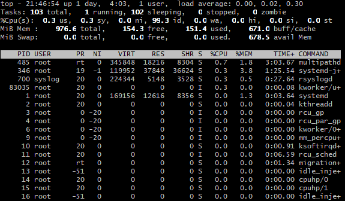
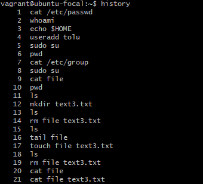
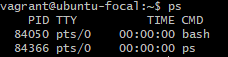
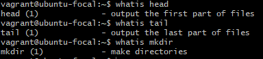
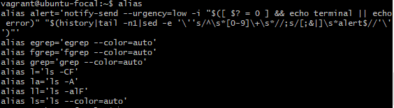
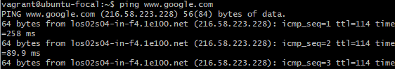
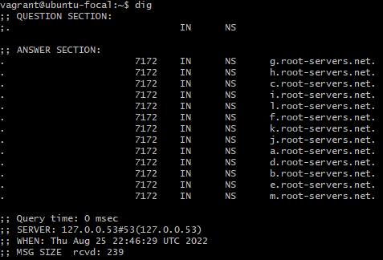

## Linux commands
 
1. **df**   

Use the **df** command to see the available disk space in each of the partitions in your system.

2. **du**  

Use the **du** command to know the disk usage of a file in your system.

 

3. **uname -a**  

Use the command **uname -a** to print most of the information about the system. Eg the kernel release date, version, processor type, etc

4. **top**  

The **top** command displays a list of running processes and how much CPU each process uses.

5. **history**  

The **history** command is used to view the commands you’ve entered before.

6. **ps**  

**ps** prints useful information about the programs/process currently running.

7. **whatis**  

**whatis** displays a single-line description of any other command, therefore making it a helpful reference.

8. **alias**  

**alias** list all the aliases in your shell session.

9. **ping**  

Use **ping** to check the connection to a server.

10. **dig**  

**dig** is used to retrieve information about DNS name servers.

