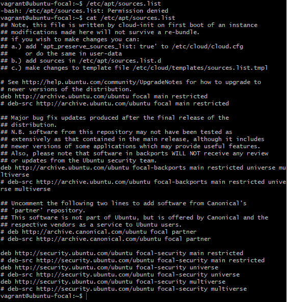
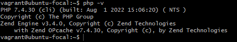

### PHP 7.4

#### In this exercise, i did the following;

<ul>

<li> I Learnt how to use the add-apt-repository command </li>

<li>I Installed the PHP 7.4 on me local linux machine using the ppa:ondrej/php package repo </li>

 

See below the contents of /etc/apt/sources.list and the output of php -v command.

##### /etc/apt/sources.list

##### php -v

