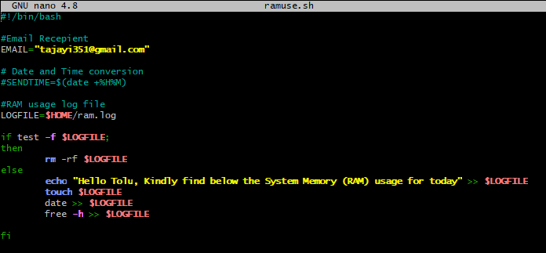
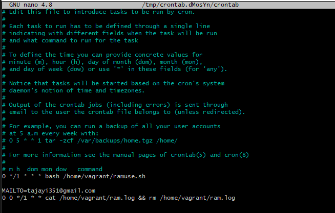
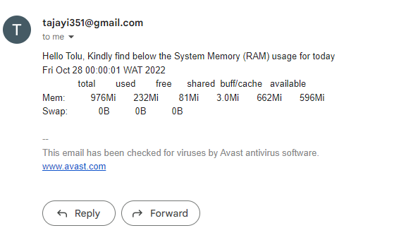

## I Created a bash script to run at every hour, saving system memory (RAM) usage to a specified file and at midnight it sends the content of the file to a specified email address, then starts over for the new day. See below screenshot of my script, cronjob and a sample of the mail sent the the specified mail
 

### Script

### Cronjob

### Email

