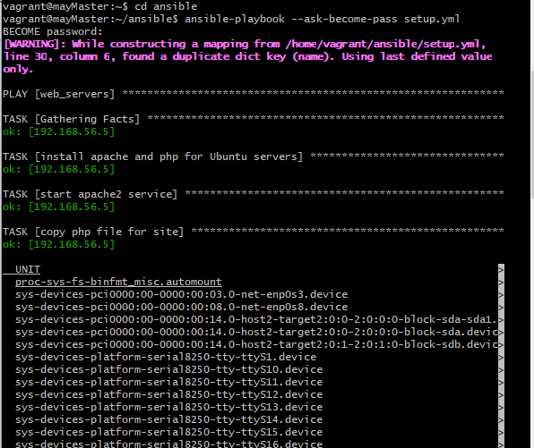

#### I created an Ansible Playbook to setup a server with Apache. The server was set to the Africa/Lagos Timezone. I also hosted an index.php file with the following content, as the main file on the server
<?php
date("F d, Y h:i:s A e", time());
?>

 

### Ansible Playbook

### Systemctl

### Webpage

